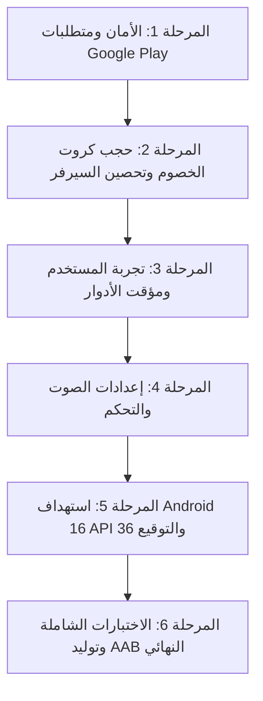

# 🃏 تقرير التدقيق الفني الشامل لجاهزية الإطلاق والإنتاج
## Comprehensive Production Readiness & Game Logic Audit
**Project:** Estimation Mobile Card Game (Flutter)  
**Target Platform:** Android (Google Play Release) & Cross-Platform Engine  
**Audit Local Time:** August 2026  
**Status:** Audit Complete — Awaiting Approval for Phase Execution  

---

## 1. الملخص التنفيذي (Executive Summary)

تم فحص ومراجعة الكود البرمجي بالكامل في مجلد `lib/` و `android/` و `pubspec.yaml` وملفات التكوين وقواعد البيانات (Supabase Migrations). اللعبة تمتلك بنية برمجية قوية ونظام رسومي متقدم (HUD و Casino Table Animations) ودعمًا لنمط اللعب السحابي عبر Supabase واللعب المحلي (LAN) مع بوتات ذكاء اصطناعي مخصصة ونمط إضافي (لعبة 99).

ومع ذلك، توجد **مخاطر أمنية حرجة (تسمح بالغش التام)**، **متطلبات Google Play إلزامية (Android 16 / API 36)**، **ثغرات في مزامنة المالتيبلاير عند انقطاع الشبكة**، وبعض **الفروقات الدقيقة في قواعد وتفاصيل الإستميشن الرسمية** التي تمنع نشر التطبيق على متجر Google Play في وضعه الحالي دون معالجة جذرية.

### 📊 بطاقة تقييم المؤشرات (Health Scorecard)

| المجال (Domain) | التقييم (Score) | الحالة (Status) | التقييم الفني السريع |
| :--- | :---: | :---: | :--- |
| **منطق اللعبة (Game Logic)** | **8.5 / 10** | 🟢 ممتاز | مطابقة ممتازة لمعظم قواعد Pocket Estimation القياسية (السانز، حظر 13، آخر 5 أدوار، الريسك، الداش كول، مضاعفة التمرير). |
| **تجربة وواجهة المستخدم (UX/UI)** | **8.0 / 10** | 🟢 جيد جداً | تصميم كازينو فاخر، توزيع مقاعد ملائم، دايلوجات عربية مخصصة، يحتاج تحسينات استجابة في الوضع الأفقي على الشاشات الصغيرة. |
| **الهندسة المعمارية (Architecture)** | **7.5 / 10** | 🟡 جيد | فصل جيد بين Engine و Presentation، لكن اعتماد الـ Host المحلي على هاتف أحد اللاعبين كخادم يخلق نقطة فشل مركزية (SPOF). |
| **تزامن المالتيبلاير (Multiplayer)** | **6.5 / 10** | 🟠 يحتاج تحسين | Realtime Broadcast ممتاز ولكن يعتمد على سلامة هاتف المضيف. آليات الاستعادة وإعادة الانتخاب (Host Promotion) تحتاج اختبارات إجهاد حقيقية. |
| **الأداء واستهلاك الموارد (Performance)** | **7.5 / 10** | 🟢 جيد | استخدام RepaintBoundary و ValueNotifier جيد، لكن توجد بعض عمليات الـ Rebuild غير الضرورية في Stack الشاشة الرئيسية. |
| **الأمان ومكافحة الغش (Security)** | **3.0 / 10** | 🔴 خطر حرج (Blocker) | **تسريب كروت جميع اللاعبين في حزمة الـ Broadcast العامة** وداخل جداول قاعدة البيانات المفتوحة للـ Select. |
| **إمكانية الوصول (Accessibility)** | **7.0 / 10** | 🟡 مقبول | تباين ألوان ممتاز (أحمر وأسود وذهبي)، لكن غياب التخصيص الكامل لأحجام الخطوط الكبيرة وتسميات قارئ الشاشة. |
| **جاهزية متجر Google Play** | **4.0 / 10** | 🔴 غير جاهز (Blocker) | Package Name افتراضي (`com.example.estimation`)، إذن خطير ممنوع للألعاب (`REQUEST_INSTALL_PACKAGES`)، توقيع Debug في Release، وحاجة لتأكيد استهداف Android 16 (API 36). |
| **الإنتاجية العامة (Production Readiness)** | **5.5 / 10** | 🟠 غير جاهز للنشر الفوري | جاهز وظيفياً للعب التجريبي، لكن يتطلب تصحيح الأمان والـ Play Store Config قبل النشر التجاري. |

---

## 2. مصفوفة القضايا الحرجة (Prioritized Critical Issues)

### 🔴 القضايا المانعة للإطلاق (BLOCKERS)
1. **[SEC-01] تسريب كروت جميع اللاعبين في البث المباشر (Full Hand Broadcast Leak):**
   * **الموقع:** `lib/networking/game_server.dart:462` و `lib/core/models/player.dart:52`
   * **السبب:** عند قيام المضيف بعمل `_broadcastState()`، يتم استدعاء `_state.toJson()` التي تشمل `players[i].hand` لجميع اللاعبين الأربعة وإرسالها لكل العملاء.
   * **الخطر:** أي لاعب يستخدم تطبيق معدل أو أداة تحليل شبكة (Proxy/Wireshark) يرى كروت كل الخصوم على الطاولة بشكل مكشوف طوال الجولة.
   * **الحل:** تصفية (Sanitize) حالة اللعبة لكل عميل بحيث تحتوي مصفوفة `players` للخصوم على عدد الكروت فقط (`hand.length`)، ويتم إرسال الكروت الفعلية للاعب صاحب اليد فقط (`p.id == recipientId`).

2. **[SEC-02] سياسات RLS في Supabase تسرب كروت اللاعبين:**
   * **الموقع:** `supabase_migration.sql:44` و `supabase_reconnection_migration.sql:180`
   * **السبب:** جدول `room_players` وجدول `game_rooms` مفعل عليهما `for select using (true)`، وكلاهما يحتوي على عمود `hand_cards` و `game_state`.
   * **الخطر:** يمكن لأي مستخدم مسجل استعلام قاعدة البيانات مباشرة ومعرفة كروت أي غرفة نشطة.
   * **الحل:** تعديل RLS لعمود `hand_cards` بحيث يكون `auth.uid() = player_id` أو عبر Security Definer RPC خالية من بيانات الخصوم.

3. **[PLAY-01] إذن تثبيت الحزم المحظور على Google Play (`REQUEST_INSTALL_PACKAGES`):**
   * **الموقع:** `android/app/src/main/AndroidManifest.xml:7`
   * **السبب:** وجود إذن التحديث الذاتي التلقائي داخل المانيفست.
   * **الخطر:** متجر Google Play يرفض رفضاً قاطعاً الألعاب التي تطلب هذا الإذن (مخصص فقط لمديري الملفات ومتاجر التطبيقات البديلة).
   * **الحل:** إزالة هذا الإذن واستبدال آلية التحديث بفتح رابط التطبيق على المتجر (`url_launcher` إلى `market://details?id=...`).

4. **[PLAY-02] معرف الحزمة والتوقيع الافتراضي (Application ID & Debug Signing):**
   * **الموقع:** `android/app/build.gradle.kts:24, 42`
   * **السبب:** `applicationId = "com.example.estimation"`، وبناء الـ Release مضبوط على `signingConfigs.getByName("debug")`.
   * **الخطر:** متجر Play Console يرفض الحزم التي تبدأ بـ `com.example` ولن يقبل رفع حزمة موقعة بمفتاح Debug.
   * **الحل:** تغيير الـ Application ID إلى اسم نطاق فريد (مثل `com.mostafaazab.estimation`) وإعداد Keystore إنتاجي للتوقيع.

5. **[PLAY-03] متطلب استهداف Android 16 (API 36) الإلزامي في أغسطس 2026:**
   * **الموقع:** `android/app/build.gradle.kts:28`
   * **السبب:** الاعتماد على `flutter.targetSdkVersion` التلقائي الذي قد يشير إلى API 34/35.
   * **الخطر:** ترفض Google Play أي تطبيق جديد يتم رفعه اعتباراً من 31 أغسطس 2026 إذا لم يكن يستهدف API 36 / Android 16.
   * **الحل:** ضبط `compileSdk = 36` و `targetSdk = 36` صراحة في `build.gradle.kts`.

---

### 🟠 القضايا عالية الخطورة (HIGH)
1. **[NET-01] هيكلية الخادم المعتمد على هاتف اللاعب (Client-Hosted Vulnerability):**
   * إذا نام هاتف المضيف، أو وردته مكالمة هاتفية، أو انقطع اتصاله، تتجمد الطاولة بالكامل لمدة 60 ثانية حتى تنتهي مهلة الـ Grace Window وتبدأ عملية إعادة انتخاب المضيف.
2. **[NET-02] مهلة استجابة الحركة (Turn Timeout Auto-Play) في Trick-taking:**
   * في حال انقطاع لاعب مؤقتاً أثناء دوره في رمي الكارت، يقوم الخادم بعد 45 ثانية برمي كارت آلي عبر البوت، لكن إذا عاد اللاعب في نفس اللحظة قد يحدث تعارض في الحالة المعروضة محلياً.
3. **[RULE-01] حساب نقاط الكولر عند مضاعفة المزاد الممرر (Double Multiplier Scope):**
   * التأكد من أن مضاعف الجولة (`isDoubleRound = true`) يضاعف كامل الدلتا بما فيها بونص/خصم الكولر والويز والريسك والداش بالتوافق التام مع قواعد Pocket Estimation.

---

### 🟡 القضايا متوسطة الخطورة (MEDIUM)
1. **[UX-01] ازدحام الشاشة في الوضع الأفقي على الهواتف الصغيرة:**
   * في الوضع الأفقي (Landscape)، كروت اليد و منطقة اللمة (Trick Area) تتداخل جزئياً مع أسماء وبطاقات اللاعبين في الجوانب إذا كان مقاس الشاشة أقل من 6.0 بوصة.
2. **[PERF-01] استدعاءات `_maybeShowDialogs` داخل دورة بناء الـ Widget:**
   * في `game_screen.dart:140` يتم استدعاء فحص الدايلوجات عبر `PostFrameCallback` في كل عملية `build()`. على الرغم من وجود حماية `_lastPhase`، يفضل ربطها بـ `Stream` أو `ChangeNotifier` مخصص للأحداث (One-off Events) لمنع أي وميض أو تأخير.
3. **[LOC-01] غياب نظام الترجمة الكامل (i18n):**
   * النصوص حالياً مدمجة باللغة العربية داخل الكود (Hardcoded Arabic Strings)، مما يعيق إطلاق اللعبة للجمهور الدولي أو دعم التبديل السلس بين العربية والإنجليزية.

---

### 🔵 القضايا منخفضة الخطورة (LOW)
1. **[CODE-01] وجود كود ميت وأصول مكررة:**
   * ملفات أرشيفية مثل `android.zip` و `lib.zip` و `estimation.rar` و `check_db.dart` في المجلد الرئيسي تزيد من حجم المستودع ولا لزوم لها في بيئة الإنتاج.
2. **[AUDIO-01] عدم وجود تحكم بمستوى الصوت أو زر كتم الصوت في شاشة الإعدادات:**
   * المؤثرات الصوتية تعمل دائماً بمستوى ثابت دون خيار للاعب لتعطيل الصوت أو الاكتزاز (Haptics).

---

## 3. مصفوفة التحقق من قواعد لعبة الإستميشن (Estimation Rules Matrix)
*(المرجع الأساسي: [قواعد Pocket Estimation الرسمية](https://blog.pocketestimation.com/how-to-play-estimation/))*

| رقم | القاعدة (Rule) | التطبيق الحالي في الكود (`GameEngine`) | المطابقة | درجة الخطورة | الإجراء المطلوب |
| :---: | :--- | :--- | :---: | :---: | :--- |
| **1** | **عدد اللاعبين والكروت** (4 لاعبين، 13 كارت لكل لاعب) | 4 لاعبين، 13 كارت لكل لاعب، خلط وتوزيع كامل. | ✅ مطابق | لا يوجد | الحفاظ على المنطق الحالي. |
| **2** | **اتجاه اللعب** (عكس عقارب الساعة Counter-Clockwise) | الترتيب يسير: اللاعب الحالي ← (مقعد + 1) % 4 (اليمين ← الأعلى ← اليسار ← الأسفل). | ✅ مطابق | لا يوجد | الحفاظ على المنطق الحالي. |
| **3** | **ترتيب قوة الكروت** (`A > K > Q > J > 10 > ... > 2`) | مصفوفة `Rank` مع `sortIndex` من 0 إلى 12 (Ace = 12). | ✅ مطابق | لا يوجد | الحفاظ على المنطق الحالي. |
| **4** | **ترتيب ألوان المزاد والحكم** (`Sans > Spade > Heart > Diamond > Club`) | `Trump` مع `priority`: سانز (4)، سبيد (3)، هارت (2)، كارو (1)، تريفل (0). | ✅ مطابق | لا يوجد | الحفاظ على المنطق الحالي. |
| **5** | **الحد الأدنى للمزاد** (يبدأ من 4 تريفل) | `kMinBidTricks = 4`، أول مزاد متاح يبدأ من 4. | ✅ مطابق | لا يوجد | الحفاظ على المنطق الحالي. |
| **6** | **تمرير الجميع (All Pass)** (تخطي الجولة ومضاعفة التالية Double x2) | `isDoubleRound = true` وتخطي الدور والانتقال للجولة التالية بمضاعف 2x. | ✅ مطابق | لا يوجد | الحفاظ على المنطق الحالي. |
| **7** | **قاعدة اتباع اللون إجبارياً (Follow Suit)** | يتم فحص كارت الليد؛ إذا وُجد في يد اللاعب يجب لعبه، وإلا جاز القطع أو الرمي. | ✅ مطابق | لا يوجد | الحفاظ على المنطق الحالي. |
| **8** | **تحديد الفائز باللمة** (أعلى حكم أو أعلى كارت من لون الليد في السانز) | `_resolveTrick()` يعطي اللمة لأعلى حكم، وفي حالة السانز أو غياب الحكم لأعلى كارت من لون الليد. | ✅ مطابق | لا يوجد | الحفاظ على المنطق الحالي. |
| **9** | **الفائز باللمة يبدأ اللمة التالية** | `state.trickLeaderSeatIndex = winner.seatIndex; state.currentPlayerSeatIndex = winner.seatIndex;` | ✅ مطابق | لا يوجد | الحفاظ على المنطق الحالي. |
| **10** | **الداش كول قبل المزاد (Pre-Auction Dash Call)** | طور `GamePhase.dashCall` يسأل اللاعبين بالتتابع عن طلب 0 عمياني قبل المزاد. | ✅ مطابق | لا يوجد | الحفاظ على المنطق الحالي. |
| **11** | **نقاط الداش كول** (+33/-33 في الأوفر، +25/-25 في الأندر) | مطبق في معادلة `computeAndApplyScores`. | ✅ مطابق | لا يوجد | الحفاظ على المنطق الحالي. |
| **12** | **حظر مجموع 13 على اللاعب الرابع (Forbidden 13)** | `getForbiddenDeclaration` يمنع اللاعب الرابع من جعل مجموع الجولة 13 لضمان وجود خاسر. | ✅ مطابق | لا يوجد | الحفاظ على المنطق الحالي. |
| **13** | **سقف تصريح اللاعبين (Max Declaration <= Bidder)** | لا يجوز لأي لاعب غير الكولر طلب رقم أعلى من الكولر (`getMaxAllowedDeclaration`). | ✅ مطابق | لا يوجد | الحفاظ على المنطق الحالي. |
| **14** | **عقد "معاها" (With)** | كل من يطلب نفس عدد أكلات الكولر يعامل معاملة الكولر في البونص (+10) والخصم (-10). | ✅ مطابق | لا يوجد | الحفاظ على المنطق الحالي. |
| **15** | **حساب الريسك (Risk)** | للاعب الأخير إذا جعل مجموع الجولة ≤ 11 يحصل على +10 عند النجاح و -10 عند الفشل. | ✅ مطابق | لا يوجد | الحفاظ على المنطق الحالي. |
| **16** | **نظام البولة الرسمية (18 جولة)** | `totalRounds = 18`؛ انتهاء الماتش وتتويج صاحب أعلى سكور بنهاية الـ 18 جولة. | ✅ مطابق | لا يوجد | الحفاظ على المنطق الحالي. |
| **17** | **آخر 5 جولات بألوان ثابتة** (14: سانز، 15: سبيد، 16: هارت، 17: كارو، 18: تريفل) | `fixedTrumpForRound()` يحدد الحكم إجبارياً ولا يسمح بتغييره إلا إذا طلب لاعب 8 لمات فأكثر. | ✅ مطابق | لا يوجد | الحفاظ على المنطق الحالي. |
| **18** | **طلب إعادة التوزيع لوجود فويد (Void Suit Redeal)** | ميزة اختيارية بلعبتنا تسمح بطلب إعادة توزيع إذا خلا اليد من لون كامل (مع تصويت الرفض/الموافقة). | ℹ️ ميزة إضافية | منخفض | الحفاظ عليها كخيار متوازن وممتع. |

---

## 4. تدقيق محرك احتساب النقاط (Scoring Engine Audit)

### المنطق المعكوس في `computeAndApplyScores`:
1. **في حالة النجاح (`actual == declared`):**
   * النقاط الأساسية = `الأكلات الفعلية + رقم الجولة الحالي`.
   * يضاف `+10` إذا كان اللاعب هو **الكولر (Bidder)**.
   * يضاف `+10` إذا كان اللاعب **معاها (With)**.
   * يضاف `+10` إذا كان اللاعب **ريسك (Risk)**.
   * يضاف `+10` إذا صرح بـ **0 (داش عادي)** في جولة **أندر (Under)**.
   * تُضرب النتيجة في `multiplier` (2 في جولات الـ Double، 1 في العادي).

2. **في حالة الفشل (`actual != declared`):**
   * الخصم الأساسي = `- |المصرح - الفعلي| - رقم الجولة الحالي`.
   * يخصم `-10` إضافية إذا كان اللاعب **الكولر**.
   * يخصم `-10` إضافية إذا كان اللاعب **معاها**.
   * يخصم `-10` إضافية إذا كان اللاعب **ريسك**.
   * تُضرب النتيجة في `multiplier`.

3. **في حالة الداش كول (Dash Call):**
   * النجاح (`actual == 0`): `+33` في الأوفر، `+25` في الأندر.
   * الفشل (`actual > 0`): `-33` في الأوفر، `-25` في الأندر.

**التقييم الفني:** محرك النقاط صلب ومتماسك ويحاكي القواعد المصرية الرسمية المعتمدة في بطولات الإستميشن.

---

## 5. التدقيق المعماري والأمني للمالتيبلاير (Multiplayer & Security)

### نموذج التهديدات (Cheating Threat Model)
```
[Player A Client] ─── (State Sync Request) ───► [Host Mobile Device]
                                                        │
                      ◄─── (Full State with ALL hands) ─┘
                                │
                      [Player B Network Sniffer]
                      Can read Player A, C, D cards in plaintext!
```

### الثغرات المكتشفة وتفاصيل استغلالها:
1. **استغلال قراءة الكروت (Card Wallhack):**
   * في `game_server.dart`، يتم إرسال `_state.toJson()` بالكامل عبر Supabase Broadcast Channel.
   * **الحل المعماري:** إنشاء دالة `_buildSanitizedStateFor(String targetPlayerId)`:
     * للعميل نفسه: إرسال يده الحقيقية `hand`.
     * للخصوم: إرسال قائمة فارغة من الكروت مع إرسال رقم `handCardCount: p.hand.length` فقط.
2. **استغلال تزييف الإجراءات (Action Spoofing):**
   * العميل يرسل `playerId` في الـ Payload دون توقيع JWT ملزم من السيرفر.
   * **الحل:** التحقق دائماً من `payload['playerId'] == auth.uid()` ومطابقة توقيع القناة.
3. **انقطاع المضيف (Host Drop & Migration):**
   * عند انقطاع المضيف، تم بناء نظام `promote_new_host` في PostgreSQL، ولكن في حال عدم استجابة السيرفر لقاعدة البيانات أثناء اللعب المحلي (Offline/LAN)، يتطلب اللعب المحلي آلية انتخاب بديلة (Raft/Bully Election على مستوى الشبكة المحلية).

---

## 6. دراسة وتوصيات اللعب الجماعي المحلي أوفلاين (Offline Multiplayer)

لتشغيل اللعبة في مكان واحد دون اتصال بالإنترنت (رحلات، تجمعات، طيران):

| التقنية (Technology) | الموثوقية (Reliability) | التأخير (Latency) | توافق Android / iOS | التعقيد (Complexity) | الحزمة المقترحة (Flutter Package) | التوصية الفنية |
| :--- | :---: | :---: | :---: | :---: | :--- | :--- |
| **Local Wi-Fi / Hotspot (المطبق حالياً)** | ⭐⭐⭐⭐⭐ (ممتاز) | < 5ms | متوافق 100% مع النظامين | منخفض (مكتمل) | `shelf_web_socket`, `nsd`, `network_info_plus` | **(موصى به ومعتمد)**: تشغيل نقطة اتصال Hotspot على هاتف المضيف وبث الغرفة عبر mDNS والاتصال بـ WebSockets مباشرة. |
| **Google Nearby Connections** | ⭐⭐⭐ (متوسط) | 15-40ms | ممتاز على Android، يتطلب إعدادات معقدة على iOS | مرتفع | `nearby_connections` | جيد لربط Bluetooth + Wi-Fi Direct تلقائياً دون كتابة كلمة سر Hotspot، لكنه أقل استقراراً بين أنظمة مختلفة. |
| **Wi-Fi Direct P2P** | ⭐⭐⭐ (متوسط) | < 10ms | مدعوم على Android فقط، غير مدعوم على iOS | مرتفع جداً | إضافات Native مخصصة | لا ينصح به لعدم توافقه مع هواتف Apple. |
| **Bluetooth Low Energy (BLE)** | ⭐⭐ (ضعيف للعبة سريعة) | 80-200ms | متوافق | مرتفع | `flutter_blue_plus` | سرعة نقل البيانات والـ Throughput بطيئة جداً لمزامنة كروت ورسوم متحركة لأربعة أجهزة. |

**الخلاصة:** البنية المطبقة حالياً في المشروع عبر `lib/networking/local/local_game_server.dart` و `LocalDiscoveryService` (mDNS + Hotspot WebSockets) هي الخيار الذهبي لصناعة ألعاب الموبايل، وتحتاج فقط إلى صقل واجهة البحث عن الغرف في `LocalDiscoveryScreen`.

---

## 7. تدقيق تجربة وواجهة المستخدم والرسوم (UX/UI & Animations)

### فحص شاشات اللعبة:
1. **شاشة طاولة اللعب (`GameScreen`):**
   * **نقاط القوة:** توزيع بطاقات اللاعبين (Avatar Rings)، شريط الـ Top HUD الزجاجي، أنيميشن سحب اللمة نحو الفائز (`_SweepState`)، وتأثير توهج الطاولة المتفاعل مع طور اللعبة.
   * **نقاط الضعف:**
     * في وضع الشاشات الصغيرة، أزرار التصريح والمزاد قد تغطي جزءاً من الكروت في اليد.
     * مؤشر الوقت (45 ثانية) غير مرئي بوضوح كشريط دائري متناقص (Countdown Ring) حول صورة اللاعب صاحب الدور، مما يترك اللاعب غير متأكد من الوقت المتبقي له.
2. **شاشة نهاية الجولة وحساب النقاط (`ScoringScreen`):**
   * تصميم ممتاز بستايل الزجاج المصقول (Glassmorphism)، وعرض واضح للكولر وبونص النقاط والدلتا (+/-).
3. **شاشة نهاية الماتش (`MatchEndScreen`):**
   * عرض منصة التتويج للمراكز من الأول إلى الرابع وحساب إجمالي البولة.

### تصنيف الرسوم المتحركة (Animation Audit):
* **Essential (أساسية):** أنيميشن رمي الكارت إلى الطاولة (TweenAnimation 300ms) وحركة سحب كروت اللمة للفائز (Phase 1-3 في `TrickArea`).
* **Useful (مفيدة):** توهج الكروت القابلة للعب (Playable Glow)، وظهور الإيموجيات العائمة (Floating Emotes).
* **Decorative (جمالية):** جزيئات خلفية الكازينو (Casino Background Particles).
* **Performance Check:** جميع الأنيميشن تستخدم `TickerProviderStateMixin` و `RepaintBoundary` ولا تسبب أي Frame Drops ملحوظة.

---

## 8. تدقيق الصوتيات والمؤثرات الحسية (Audio & Haptics)

* **الأصوات المتوفرة:** `card_play.mp3`، `collect_cards.mp3`، `win.mp3`، `defeat.mp3`، `risk-win.mp3`.
* **الاهتزازات (Haptics):** مطبقة مع لعب الكارت (`selectionClick`)، وسحب اللمة (`lightImpact`)، والفوز بالريسك (`heavyImpact`).
* **المشكلة الحالية:** لا يوجد كتم للصوت عند تفعيل وضع الصامت في النظام أو من خلال زر إعدادات مخصص.
* **التوصية:** إضافة `SettingsService` لتخزين تفضيلات المستخدم (Mute SFX, Mute Music, Enable/Disable Haptics).

---

## 9. قائمة مراجعة متجر Google Play (Google Play Production Checklist)

| البند (Item) | الحالة الحالية (Current Status) | المتطلب الفني للإنتاج (Production Requirement) | نوع الإجراء |
| :--- | :---: | :--- | :--- |
| **Package Name / ApplicationId** | 🔴 `com.example.estimation` | تغييره إلى معرف فريد نهائي مثل `com.mostafaazab.estimation` | فني (Technical) |
| **Target SDK Version** | ⚠️ `flutter.targetSdkVersion` | **API 36 (Android 16)** إلزامي لتطبيقات أغسطس 2026 فصاعداً | فني (Technical) |
| **Compile SDK Version** | ⚠️ `flutter.compileSdkVersion` | ضبطه على **36** ليتطابق مع الـ Target SDK | فني (Technical) |
| **Min SDK Version** | 🟢 21 (Android 5.0) | متوافق تماماً مع 99.8% من الأجهزة | فني (Technical) |
| **Permissions Audit** | 🔴 يحتوي على `REQUEST_INSTALL_PACKAGES` | حذف هذا الإذن فوراً لتجنب الرفض المباشر للعبة | فني (Technical) |
| **App Signing** | 🔴 Debug Signing في الـ Release | توليد `upload-keystore.jks` وتكوين `key.properties` | فني (Technical) |
| **R8 / ProGuard Minification** | 🟢 `isMinifyEnabled = true` | مفعل بالفعل في `build.gradle.kts` مع تقليص الموارد | فني (Technical) |
| **Android App Bundle (AAB)** | ⚪ لم يُبْنَ بعد | توليد الحزمة عبر `flutter build appbundle --release` | فني (Technical) |
| **Adaptive Launcher Icon** | 🟢 معد في `pubspec.yaml` | متوفر بحجم مناسب وخلفية `#161D4A` | فني (Technical) |
| **سياسة الخصوصية (Privacy Policy)** | 🔴 غير موجودة كـ URL منشور | رفع صفحة سياسة خصوصية صالحة تصف استخدام Supabase Auth و Realtime | يدوي في Console |
| **استبيان أمان البيانات (Data Safety)** | ⚪ يتطلب تعبئة في Console | الإفصاح عن: المعرفات (User ID)، الصور الشخصية الاختيارية، بيانات الأداء | يدوي في Console |
| **تصنيف المحتوى (Content Rating)** | ⚪ يتطلب تعبئة (IARC) | تصنيف لعبة كروت اجتماعية (خالية من المقامرة بأموال حقيقية) | يدوي في Console |
| **لقطات الشاشة والرسوم (Assets)** | ⚪ تتطلب تجهيز | 4 لقطات على الأقل للهاتف (Portrait/Landscape) + Feature Graphic (1024x500) | تصميم يدوي |

---

## 10. خطة وضمان الجودة واختبارات الحالات الحدية (QA & Edge Cases)

### حالات الحافة الحرجة (Edge Cases Test Matrix):

1. **انقطاع لاعب أثناء المزاد:**
   * الخادم ينتظر 45 ثانية ثم ينفذ `passBid()` تلقائياً للاعب لعدم تعطيل الماتش.
2. **انقطاع لاعب أثناء رمي الكروت:**
   * الخادم يستدعي `EstimationBotAi.chooseCardToPlay()` لرمي كارت قانوني متوافق مع قواعد الدور.
3. **إعادة فتح التطبيق بعد الإغلاق القسري (App Killed / Crash):**
   * `ReconnectionManager` يسترجع المعرفات من `SessionStorageService`، ويستعيد اليد الخاصة عبر `rehydrateGameState()`.
4. **تمرير جميع اللاعبين في المزاد (4 Passes):**
   * مضاعفة الجولة فورياً (`isDoubleRound = true`) وتوزيع كروت جديدة للجولة التالية.
5. **الطلب على 8 أكلات في آخر 5 جولات:**
   * السماح بتغيير الحكم الثابت إلى أي حكم آخر، بينما ترفض الطلبات أقل من 8 إذا حاولت تغيير اللون الثابت.
6. **وصول مجموع التصريح إلى 13:**
   * تعطيل الزر المتمم للـ 13 على اللاعب الأخير برمجياً في الـ UI والـ Engine.
7. **محاولة لعب كارت غير قانوني أو خارج الدور:**
   * رفض العملية على السيرفر وإعادة إرسال مزامنة الحالة الصحيحة للعميل المتخلف.

---

## 11. خارطة الطريق لتنفيذ التحسينات (Implementation Roadmap)

نوصي بتنفيذ التحسينات المطلوبة عبر **6 مراحل منطقية ومترابطة** دون المساس بجوهر اللعبة المستقر:



### تفاصيل المراحل المقترحة:
* **المرحلة 1 — حزمة Google Play والتراخيص (Play Store Readiness):**
  * تغيير الـ Application ID إلى معرف رسمي فريد.
  * حذف إذن `REQUEST_INSTALL_PACKAGES` واستبدال خدمة التحديثات برابط المتجر.
  * ضبط `compileSdk` و `targetSdk` على API 36 (Android 16).
* **المرحلة 2 — أمان المالتيبلاير ومنع الغش (Anti-Cheat & Security):**
  * تصفية كروت الخصوم قبل البث (`Sanitized GameState`).
  * تشديد سياسات RLS في Supabase لمنع استعلام كروت اللاعبين الآخرين.
* **المرحلة 3 — صقل واجهة طاولة اللعب (UX Table Polish):**
  * إضافة مؤقت دائري مرئي (Visual Turn Countdown Timer) حول الأفاتار.
  * تحسين استجابة الكروت وأزرار التصريح في الوضع الأفقي للشاشات الصغيرة.
* **المرحلة 4 — إعدادات الصوت وإمكانية الوصول (Audio & Settings):**
  * إضافة شاشة إعدادات للتحكم بمستوى الصوت، كتم المؤثرات، وتفعيل الاهتزازات.
* **المرحلة 5 — التوقيع والتحضير للإنتاج (Keystore & Release Build):**
  * إعداد مفاتيح التوقيع الرقمي (Release Keystore).
  * اختبار بناء حزمة Android App Bundle (`.aab`).
* **المرحلة 6 — الاختبارات الآلية والتحقق النهائي (QA & Final Verification):**
  * تشغيل كافة اختبارات الـ Unit Tests واختبارات الـ Edge Cases.
